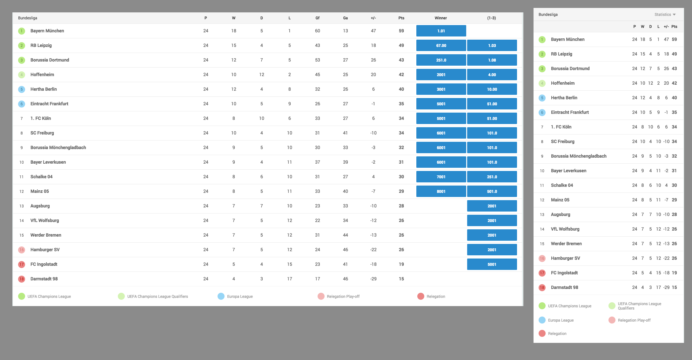

# league-table-widget



Displays the league teams with statistics, with data from statistics api. Also shows betoffers based on the criterionId provided through the args. By default it shows the betoffers to win and to be placed in the top positions of the tournament provided.

This widget has a mobile mode, when the width of the widget is small a column picker appears in the top right of the widget that allows the user to change the table from showing the statics to show the betoffers.

## Configuration example:

Arguments and default values:

```json
...
{
    "args": {
        "filter": null,
        "criterionId": 1001221607,
        "title": null,
        "widgetTrackingName": "gm-league-table-widget"
    }
},
...

```

### The widget accepts the following arguments:

1. `filter` - string - Filter string to force this widget to show a specific competition. Example: '/football/england/premier_league'. If null will use CoreLibrary.pageInfo.leaguePaths
2. `criterionId` - number - Criterion identifier for bet offers to be matched against. Defaults to the betoffers to win and to be placed in the top positions of the tournament provided. The default only works for FOOTBALL competitions.
3. `title` - string - Forces title of the widget to this value. If null will use the competition name
4. `widgetTrackingName` - string - tracking name for analytics purposes


### Build Instructions

Please refer to the [core-library](https://github.com/kambi-sportsbook-widgets/widget-core-library)
